# dotnetANPR

[](https://github.com/bolorundurowb/dotnetANPR/actions/workflows/build-and-test.yml)
[](LICENSE)

Cross-platform automatic number plate recognition (ANPR) for .NET. dotnetANPR locates licence plates in car photos, segments individual characters, classifies them, and optionally corrects the result against known plate formats.

This project is a .NET port of [javaanpr](https://github.com/oskopek/javaanpr) by Ondrej Martinsky, preserving the original pipeline of histogram-based region detection, heuristic filtering, and pattern-based character recognition.

## Table of contents

- [Features](#features)
- [Project status](#project-status)
- [Requirements](#requirements)
- [Getting started](#getting-started)
- [Usage](#usage)
  - [Library](#library)
  - [Command-line tool](#command-line-tool)
  - [Diagnostics](#diagnostics)
- [How it works](#how-it-works)
- [API reference](#api-reference)
- [Configuration](#configuration)
- [Configuration reference](#configuration-reference)
- [Syntax configuration reference](#syntax-configuration-reference)
- [Development](#development)
- [Contributing](#contributing)
- [Acknowledgements](#acknowledgements)
- [License](#license)

## Features

- **End-to-end recognition** — from a full car image to a plate string in one call
- **Two classifiers** — KNN pattern matching (default) or feed-forward neural network
- **Syntax correction** — post-processing against configurable country/format templates
- **Skew correction** — optional Hough-transform de-skewing for rotated plates
- **Cross-platform** — `netstandard2.0` library with [SkiaSharp](https://github.com/mono/SkiaSharp) for image I/O
- **Inspectable pipeline** — dump intermediate processing stages as JPEGs for debugging
- **Extensible** — custom alphabets, neural networks, plate formats, and tuning parameters via XML config

## Project status

This is an active work in progress. The core recognition pipeline and CLI have been ported from javaanpr; GUI components have not. Automated recognition tests and real-world accuracy tuning are ongoing.

Contributions — bug reports, test images, alphabet data, configuration improvements, and pull requests — are welcome.

## Requirements

| Component              | Target             |
|------------------------|--------------------|
| Library (`dotnetANPR`) | .NET Standard 2.0+ |
| CLI (`dotnetANPR.CLI`) | .NET 8+            |
| Build / CI             | .NET SDK 10+       |

## Getting started

Clone the repository and build the solution:

```bash
git clone https://github.com/bolorundurowb/dotnetANPR.git
cd dotnetANPR
dotnet build ./src/dotnetANPR.slnx --configuration Release
```

### Add the library to your project

Reference the project directly (NuGet package publishing is not set up yet):

```xml
<ItemGroup>
  <ProjectReference Include="path/to/dotnetANPR/src/dotnetANPR/dotnetANPR.csproj" />
</ItemGroup>
```

### Character training data

Recognition requires alphabet training images at the path configured by `char_learnAlphabetPath` (default: `Resources/alphabets/alphabet_8x13`). If this directory is not present in your checkout, copy it from the upstream [javaanpr](https://github.com/oskopek/javaanpr) repository. Each file should be a normalised character image matching the configured dimensions (8×13 px by default).

## Usage

### Library

```csharp
using dotnetANPR;

// Recognise from a file path
string? plate = ANPR.Recognize("car.jpg");
Console.WriteLine(plate ?? "No plate found");

// Recognise from a stream
using var stream = File.OpenRead("car.jpg");
plate = ANPR.Recognize(stream);

// Recognise from a SkiaSharp bitmap
using var bitmap = SKBitmap.Decode("car.jpg");
plate = ANPR.Recognize(bitmap);
```

`Recognize` returns the plate text as a string, or `null` when no valid plate is detected. An invalid image path throws `ArgumentException`.

### Command-line tool

```bash
dotnet run --project ./src/dotnetANPR.CLI -- car.jpg

# Dump intermediate processing stages for inspection
dotnet run --project ./src/dotnetANPR.CLI -- car.jpg --dump-stages ./stages
```

Or run the built executable directly:

```bash
./src/dotnetANPR.CLI/bin/Release/net8.0/dotnetANPR.CLI car.jpg
```

### Diagnostics

Pass a `dumpDir` argument (library) or `--dump-stages <dir>` (CLI) to write sequentially numbered JPEG snapshots of each pipeline stage — thresholding, band extraction, plate cropping, character segmentation, and more. This is useful when tuning configuration or investigating misrecognitions.

## How it works

Recognition follows a multi-stage pipeline inspired by classical computer vision rather than deep learning end-to-end models:

```mermaid
flowchart LR
    A[Car image] --> B[Adaptive thresholding]
    B --> C[Band detection]
    C --> D[Plate candidate search]
    D --> E[Optional skew correction]
    E --> F[Character segmentation]
    F --> G[Feature extraction]
    G --> H[KNN or neural classifier]
    H --> I[Syntax analysis]
    I --> J[Plate text]
```



1. **Preprocessing** — adaptive thresholding converts the photo to a binary map
2. **Region search** — vertical histogram peaks locate horizontal bands; each band is searched for plate-shaped regions
3. **Heuristic filtering** — candidate plates and characters are validated by size, aspect ratio, brightness, and contrast rules
4. **Classification** — each character is normalised and matched against a learned alphabet (KNN by default)
5. **Syntax analysis** — the raw string is corrected against templates in `Resources/syntax.xml` (German, Slovak, Czech formats included)

## API reference

The static `ANPR` class is the main entry point. XML documentation is provided on all public types and members.

| Method                                                | Description                                                          |
|-------------------------------------------------------|----------------------------------------------------------------------|
| `Recognize(string imagePath, string? dumpDir)`        | Recognise a plate from a file path                                   |
| `Recognize(Stream imageStream, string? dumpDir)`      | Recognise a plate from a stream                                      |
| `Recognize(SKBitmap image, string? dumpDir)`          | Recognise a plate from a SkiaSharp bitmap                            |
| `ExportDefaultConfig(string outputFilePath)`          | Export the built-in default configuration to XML                     |
| `TrainNetworkAndExport(string outputFilePath)`        | Train a neural network on the configured alphabet and export it      |
| `NormalizeAlphabets(string sourceDir, string dstDir)` | Normalise raw alphabet character images to the configured dimensions |

Advanced use: instantiate `dotnetANPR.Intelligence.Intelligence` directly for lower-level control over `CarSnapshot` analysis and optional `StageWriter` output.

## Configuration

Pipeline behaviour is controlled by `Resources/config.xml`. Parameters are loaded at startup via the `Configurator` singleton; defaults are embedded in code and overridden by the XML file when present.

To start from the defaults and customise:

```csharp
ANPR.ExportDefaultConfig("my-config.xml");
// Edit my-config.xml, then place it at Resources/config.xml or adjust loading as needed
```

The tables below document every parameter. In most cases the defaults work well; adjust heuristics and graph parameters only when your source images differ significantly from typical front/rear car photos.

---

## Configuration reference

### Photo preprocessing

| Parameter                          | Default | Description                                                                                                        | Effect of increasing                                                                                                                                |
|------------------------------------|---------|--------------------------------------------------------------------------------------------------------------------|-----------------------------------------------------------------------------------------------------------------------------------------------------|
| `photo_adaptivethresholdingradius` | `7`     | Radius for adaptive thresholding. `0` uses plain global thresholding; `N >= 1` uses a neighbourhood of radius `N`. | Larger radius produces smoother thresholding at the cost of losing fine detail. Lower values (or 0) preserve edges but are more sensitive to noise. |

### Skew detection

| Parameter                    | Default | Description                                                                                          | Effect of changing                                                                             |
|------------------------------|---------|------------------------------------------------------------------------------------------------------|------------------------------------------------------------------------------------------------|
| `intelligence_skewdetection` | `0`     | Enables skew detection and de-skewing correction via Hough transform. `0` = disabled, `1` = enabled. | Enabling adds computational cost but corrects rotated plates, improving character recognition. |

### Plate candidate search

| Parameter                     | Default | Description                                                                      | Effect of increasing                                                                                   |
|-------------------------------|---------|----------------------------------------------------------------------------------|--------------------------------------------------------------------------------------------------------|
| `intelligence_numberOfBands`  | `3`     | Number of horizontal bands (candidate plate rows) extracted from the car image.  | More bands catch more candidates but increase processing time and false positives.                     |
| `intelligence_numberOfPlates` | `3`     | Number of plate candidates extracted from each band.                             | More candidates per band may find plates in unusual positions but increases processing time.           |
| `intelligence_numberOfChars`  | `20`    | Maximum number of character peaks extracted from a plate's horizontal histogram. | Higher values allow more characters to be segmented but risk splitting characters or picking up noise. |

### Plate heuristics

| Parameter                               | Default | Description                                                            | Effect of changing                                                                                |
|-----------------------------------------|---------|------------------------------------------------------------------------|---------------------------------------------------------------------------------------------------|
| `intelligence_minimumChars`             | `5`     | Minimum number of detected characters for a valid plate.               | Lower values accept shorter plates (e.g. motorcycles); higher values reject partial detections.   |
| `intelligence_maximumChars`             | `15`    | Maximum number of detected characters for a valid plate.               | Lower values reject over-segmented plates; higher values accept longer plate formats.             |
| `intelligence_maxCharWidthDispersion`   | `0.5`   | Maximum allowed variation in character widths relative to the average. | Higher values tolerate irregular character widths; lower values enforce uniform character widths. |
| `intelligence_minPlateWidthHeightRatio` | `0.5`   | Minimum width-to-height ratio for a valid plate.                       | Higher values reject square-ish regions; lower values accept narrower plates.                     |
| `intelligence_maxPlateWidthHeightRatio` | `15.0`  | Maximum width-to-height ratio for a valid plate.                       | Higher values accept very wide plates; lower values reject overly elongated regions.              |

### Character heuristics

| Parameter                                  | Default | Description                                                                 | Effect of increasing                                                                                       |
|--------------------------------------------|---------|-----------------------------------------------------------------------------|------------------------------------------------------------------------------------------------------------|
| `intelligence_minCharWidthHeightRatio`     | `0.1`   | Minimum width-to-height ratio for a valid character.                        | Higher values reject very narrow characters (like `1` or `I`); lower values accept them.                   |
| `intelligence_maxCharWidthHeightRatio`     | `0.92`  | Maximum width-to-height ratio for a valid character.                        | Higher values accept wider characters (like `W` or `M`); lower values reject them.                         |
| `intelligence_maxBrightnessCostDispersion` | `0.161` | Maximum allowed brightness deviation of a character from the plate average. | Higher values accept characters with more varied lighting; lower values enforce uniform brightness.        |
| `intelligence_maxContrastCostDispersion`   | `0.1`   | Maximum allowed contrast deviation of a character from the plate average.   | Higher values tolerate more varied background/text contrast; lower values enforce uniformity.              |
| `intelligence_maxHueCostDispersion`        | `0.145` | Maximum allowed hue deviation of a character from the plate average.        | Higher values accept characters with different colour tones; lower values require consistent colouring.    |
| `intelligence_maxSaturationCostDispersion` | `0.24`  | Maximum allowed saturation deviation of a character from the plate average. | Higher values tolerate varied colour intensity; lower values enforce uniform saturation.                   |
| `intelligence_maxHeightCostDispersion`     | `0.2`   | Maximum allowed height deviation of a character from the plate average.     | Higher values accept characters of differing heights; lower values require uniform height.                 |
| `intelligence_maxSimilarityCostDispersion` | `100.0` | Maximum classification cost for a recognised character to be accepted.      | Higher values accept less confident matches (more false positives); lower values require stronger matches. |

### Character normalisation and feature extraction

| Parameter                       | Default                             | Description                                                                                                                            | Effect of changing                                                                                                      |
|---------------------------------|-------------------------------------|----------------------------------------------------------------------------------------------------------------------------------------|-------------------------------------------------------------------------------------------------------------------------|
| `char_normalizeddimensions_x`   | `8`                                 | Width (in pixels) to which characters are downsampled before recognition.                                                              | Larger values preserve more detail but increase processing time and memory. Must match the learned alphabet dimensions. |
| `char_normalizeddimensions_y`   | `13`                                | Height (in pixels) to which characters are downsampled before recognition.                                                             | Same as above — must match the alphabet used for training.                                                              |
| `char_learnAlphabetPath`        | `Resources/alphabets/alphabet_8x13` | Path to the directory containing alphabet training images.                                                                             | Point to a custom alphabet for different fonts or character styles. Images must match the normalised dimensions.        |
| `char_resizeMethod`             | `1`                                 | Downsampling method. `0` = linear (better for edge detection), `1` = weighted average (better for pixel mapping).                      | Use `0` with edge-based feature extraction; use `1` with map-based feature extraction.                                  |
| `char_featuresExtractionMethod` | `0`                                 | Feature extraction method. `0` = direct pixel mapping (good for blurred characters), `1` = edge features (good for skewed characters). | Use `0` for clean/blurred characters; use `1` for skewed or deformed characters.                                        |

### Classification method

| Parameter                            | Default | Description                                                                                                 | Effect of changing                                                                                                        |
|--------------------------------------|---------|-------------------------------------------------------------------------------------------------------------|---------------------------------------------------------------------------------------------------------------------------|
| `intelligence_classification_method` | `0`     | Classification algorithm. `0` = KNN Euclidean distance pattern matching, `1` = feed-forward neural network. | Pattern matching is faster and requires no training. Neural network is more accurate but requires a trained network file. |

### Neural network parameters

| Parameter                | Default                                               | Description                                                                                                                         | Effect of changing                                                                                                    |
|--------------------------|-------------------------------------------------------|-------------------------------------------------------------------------------------------------------------------------------------|-----------------------------------------------------------------------------------------------------------------------|
| `char_neuralNetworkPath` | `Resources/neuralnetworks/network_avgres_813_map.xml` | Path to the pre-trained neural network XML file. Dimensions must match the feature extraction method and normalised character size. | Only used when `intelligence_classification_method` is `1`.                                                           |
| `neural_topology`        | `20`                                                  | Number of neurons in the hidden (middle) layer.                                                                                     | More neurons increase the network's capacity and accuracy but also increase training time and risk overfitting.       |
| `neural_maxk`            | `8000`                                                | Maximum number of training iterations (epochs).                                                                                     | Higher values allow more thorough training but may overfit. Lower values may stop before convergence.                 |
| `neural_eps`             | `0.07`                                                | Convergence threshold (epsilon). Training stops when the total gradient falls below this value.                                     | Lower values produce more precise training; higher values stop earlier (faster but less accurate).                    |
| `neural_lambda`          | `0.05`                                                | Learning rate (lambda). Controls how much weights are adjusted per iteration.                                                       | Higher values converge faster but may overshoot; lower values converge more stably but slowly.                        |
| `neural_micro`           | `0.5`                                                 | Momentum factor (micro). Persistence ratio of previous weight changes.                                                              | Higher values smooth the gradient descent and help escape local minima; lower values respond faster to new gradients. |

### Syntax analysis

| Parameter                            | Default                | Description                                                                                                                                                            | Effect of changing                                                                                                                                |
|--------------------------------------|------------------------|------------------------------------------------------------------------------------------------------------------------------------------------------------------------|---------------------------------------------------------------------------------------------------------------------------------------------------|
| `intelligence_syntaxanalysis`        | `2`                    | Syntax correction mode. `0` = no correction, `1` = correct only if character count matches a known format, `2` = correct regardless, eliminating redundant characters. | Mode `2` is most aggressive (may over-correct); mode `1` is safer. Mode `0` returns raw recognition.                                              |
| `intelligence_syntaxDescriptionFile` | `Resources/syntax.xml` | Path to the XML file defining known plate format templates.                                                                                                            | Point to a custom file to add plate formats for different countries. See [syntax configuration reference](#syntax-configuration-reference) below. |

### Graph peak analysis

These parameters control histogram peak detection used for finding plate bands, plates, and characters. They should generally not need adjustment unless the source images have unusual characteristics.

| Parameter                                         | Default | Description                                                                               | Effect of increasing                                                                                  |
|---------------------------------------------------|---------|-------------------------------------------------------------------------------------------|-------------------------------------------------------------------------------------------------------|
| `carsnapshot_graphrankfilter`                     | `9`     | Rank filter applied to the car snapshot vertical histogram.                               | Higher values produce smoother histograms, reducing noise but potentially merging nearby peaks.       |
| `carsnapshot_distributormargins`                  | `25`    | Margins for the probability distribution applied to car snapshot peaks.                   | Larger margins spread probability more broadly, favouring wider bands.                                |
| `carsnapshotgraph_peakDiffMultiplicationConstant` | `0.1`   | Multiplier for peak difference calculation in the car snapshot graph.                     | Higher values require larger gaps between peaks to be considered separate.                            |
| `carsnapshotgraph_peakfootconstant`               | `0.55`  | Fraction of peak height used to determine the foot (base) of a peak.                      | Higher values result in narrower peak boundaries; lower values widen them.                            |
| `bandgraph_peakDiffMultiplicationConstant`        | `0.2`   | Multiplier for peak difference calculation in band graphs.                                | Same as above but for plate detection within bands.                                                   |
| `bandgraph_peakfootconstant`                      | `0.55`  | Peak foot constant for band graphs (plate detection).                                     | Same effect as `carsnapshotgraph_peakfootconstant` but for plate-finding.                             |
| `plategraph_peakfootconstant`                     | `0.7`   | Peak foot constant for character segmentation within plates.                              | Higher values produce narrower character segments; lower values widen them.                           |
| `plategraph_rel_minpeaksize`                      | `0.86`  | Relative minimum peak size as a fraction of the maximum peak.                             | Higher values ignore smaller peaks (fewer character candidates); lower values detect more candidates. |
| `platehorizontalgraph_detectionType`              | `1`     | Horizontal edge detection method. `0` = magnitude derivative, `1` = Sobel edge detection. | Edge detection (`1`) is more robust for finding plate boundaries.                                     |
| `platehorizontalgraph_peakfootconstant`           | `0.05`  | Peak foot constant for the plate's horizontal edge graph (left/right bounds).             | Higher values produce tighter left/right cropping of the plate.                                       |
| `plateverticalgraph_peakfootconstant`             | `0.42`  | Peak foot constant for the plate's vertical edge graph (top/bottom bounds).               | Higher values produce tighter top/bottom cropping of the plate.                                       |

---

## Syntax configuration reference

`Resources/syntax.xml` defines known licence plate format templates per country. Each `<type>` is a named template (e.g. `germany`). Each `<char>` element defines the set of allowed characters at that position. During syntax analysis, the parser tries to match recognised text against these templates and corrects mismatches when possible.

### Format templates

| Template name            | Positions | Pattern     | Description                                                                                            |
|--------------------------|-----------|-------------|--------------------------------------------------------------------------------------------------------|
| `germany`                | 6         | `LLL DDD`   | Letters: a–z, 0, o; Digits: 0–9. German-style plate (e.g. `ABC 123`).                                  |
| `slovensko_nova`         | 7         | `LL DD LL`  | Letters: a–z, 0, o; Digits: 0–9, o. New Slovak plate (e.g. `AA 123 AB`).                               |
| `ceskoslovenska_novsia`  | 7         | `LLL DDDD`  | Letters: a–z, 0, o; Digits: 0–9, o. Newer Czechoslovak plate (e.g. `AAA 1234`).                        |
| `ceskoslovenska_starsia` | 6         | `LL DDDD`   | Letters: a–z, 0, o; Digits: 0–9, o. Older Czechoslovak plate (e.g. `AB 1234`).                         |
| `ceska_nova`             | 7         | `D L DDDDD` | First: 0–9, o; Second: c,b,k,h,l,t,m,e,p,a,s,u,j,z; Digits: 0–9, o. New Czech plate (e.g. `1A2 3456`). |

### Character set notation

- `a-z` — alphabetic characters (uppercase or lowercase)
- `0-9` — numeric digits
- `o` — the letter O, often included in digit positions because O and 0 are visually similar and frequently confused by OCR
- `0` — the digit zero, often included in letter positions for the same reason

### Adding a new format

To add a custom plate format, add a `<type>` element inside `<structure>`:

```xml
<type name="uk">
    <char content="abcdefghijklmnopqrstuvwxyz"/>
    <char content="0123456789"/>
    <char content="0123456789"/>
    <char content="abcdefghijklmnopqrstuvwxyz"/>
    <char content="abcdefghijklmnopqrstuvwxyz"/>
    <char content="abcdefghijklmnopqrstuvwxyz"/>
</type>
```

Each `<char>` element represents one position in the plate. The `content` attribute lists all characters allowed at that position.

---

## Development

### Solution layout

```
src/
├── dotnetANPR/           # Core library (netstandard2.0)
│   ├── ANPR.cs           # Public entry point
│   ├── Configuration/    # XML config loader
│   ├── ImageAnalysis/    # Plate/character segmentation
│   ├── Intelligence/     # Recognition orchestration & syntax parser
│   ├── NeuralNetwork/    # Feed-forward network implementation
│   ├── Recognizer/       # KNN and neural classifiers
│   └── Resources/        # config.xml, syntax.xml, neural networks
├── dotnetANPR.CLI/       # Sample command-line application (.NET 8)
└── dotnetANPR.Tests/     # Test project
```

### Build and test

```bash
dotnet build ./src/dotnetANPR.slnx --configuration Release
dotnet test --solution ./src/dotnetANPR.slnx
```

CI runs on every push and pull request to `master` via GitHub Actions.

## Contributing

1. Fork the repository and create a feature branch
2. Make your changes with focused commits
3. Run `dotnet build` and `dotnet test` locally
4. Open a pull request with a clear description of the change and how you tested it

Bug reports and feature requests can be filed via [GitHub Issues](https://github.com/bolorundurowb/dotnetANPR/issues). Include sample images (where possible), expected vs. actual output, and your configuration when reporting recognition problems.

## Acknowledgements

- [javaanpr](https://github.com/oskopek/javaanpr) by Ondrej Martinsky — original Java implementation and algorithm design
- [SkiaSharp](https://github.com/mono/SkiaSharp) — cross-platform 2D graphics

## License

MIT — see [LICENSE](LICENSE).
